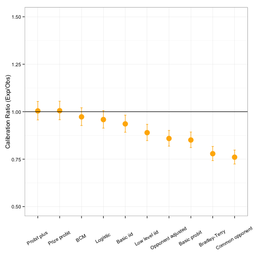
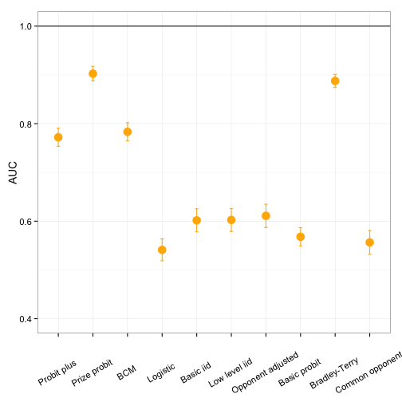
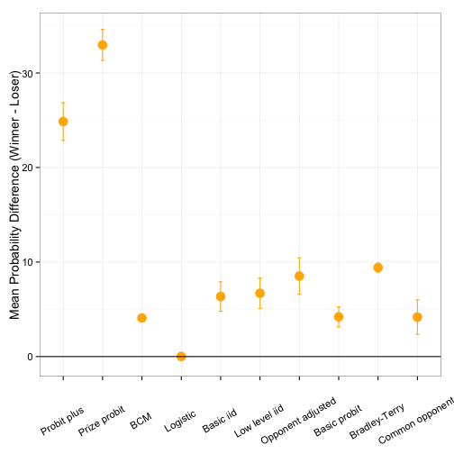

## Brief History of Tennis Prediction

> * For most of its history, tennis has lacked formal models to predict wins

> * Around 2000, the first quantitative approaches for prediction began to appear 

> * Since then a number of models have been published

> * In this talk, I will categorize models into 3 broad classes:
  - Point-based
  - Regression-based
  - Other

---

## The Validation Problem

> Though these forecasts are fascinating, what is really needed is a comparison of the forecasting accuracy of various methods. Then we can judge which forecasts to use in our fantasy leagues, draft decisions, or player personnel decisions. For example, who predicts future baseball performance better: Ron Shandler or Bill James? Perhaps in the future databases of accuracy of sports forecasts (and stock pickers) will be commonplace on the Internet.

> <cite>W. L. Winston, _Mathletics: How Gamblers, Managers, and Sports Enthusiasts Use Mathematics in Baseball, Basketball, and Football_ </cite>

--- &twocol

## The Validation Problem

* As sports analysts and fans, we think a lot about performance and how athletes stack up against their competitors

* Yet, attention to the comparative performance of prediction models in sport is often absent (at least from the scholarly literature)

* Tennis is no exception

--- &twocol

## Case for Validation

*** =left

* Distinguishing better models from worse models can help shed light on determinants of wins

* It is also important for improving future forecasts for the sport

*** =right

---

## Objectives & Design Overview

  <h3 style="color: #000000;">
    <i>The purpose of this study was to identify published models to predict the winner of a professional singles match in tennis</i>
  </h3>

> * The study design had 3 phases:
  1. Search for prediction models
  2. Fitting model parameters from the same set of match training data
  3. Evaluating model performance against an independent set of match data

---

<h2>Tennis Prediction Models</h2>

---

## Search for Prediction Models

> * Review of abstracts for relevant articles identified from Google Scholar and their citations 

> * 17 articles were screened with exclusion criteria

> * 10 models were included in the validation analysis

> * <b>Causes for Exclusion</b>
  - Not sufficient information to replicate (2 articles)
  - Not a forecasting model (2 articles)
  - Concerned previously published model (2 articles)
  - Required within-match updating (1 article)

---

## Point-Based Models

> * Four of the included models are or are extensions of the basic iid model proposed by Newton and Keller, which assumes that points won on serve and return are independent and identically distributed (iid) Bernoulli trials

> * Given the probability of winning a point on serve and return, explicit formulae can be derived for the probability of winning a game, tiebreak, set, and match 

> * The models differ in how the probabilities of serve and return are estimated

---

## Point-Based Models

| Model | Developer | Serve and Return Probabilities |
|:-----:|:--------------------:|:------:|
|Basic iid | Newton and Keller, 2005 | Player-specific average |
|Opponent-adjusted iid | Barnett and Clarke, 2005 | Average with correction for opponent serve and return ability |
|Low-level iid | Spanias and Knottenbelt, 2012 | Estimated from component events (aces, first serve wins, etc.) |
|Common opponent iid | Knottenbelt et al., 2012 |Serve and return averages among a common set of opponents |

---

## Regression-based Models

> * Four models propose a regression relationship between predictors and the probability of winning a match

> * Unlike point-based models, these model a match win directly and make no assumptions about characteristics of points within a match

> * The models differ in the set of predictors included though ALL include player rank/seeding in some form

---

## Regression-based Models

| Model | Developer | Distribution | Predictors |
|:-----:|:--------------------:|:------:|:------:|
|Logistic | Klaassen and Magnus, 2003 | Logistic | Rank differntial |
|Basic probit | Boulier and Stekler, 1999 | Probit | Seeding differential |
|Probit plus | Del Corral and Prieto-Rodriguez, 2010| Probit | Player-opponent differences in rank, demographics |
|Prize probit| Gilsdorf and Sukhatme, 2008 |Probit | Potential loss in prize money, head-to-head results, demographics |

---

<h2 style="padding: 0%;">Regression Model Predictors</h2>

|Predictor | Logistic | Basic probit |Probit plus | Prize Probit |
|:--------:|:--------:|:--------:|:--------:|:--------:|
|Difference in seeds | + | | | |
|Difference in ranks | | + | + | |
|Previous tournament result | | | + | |
|Former top 10 player | | | + | |
|Difference in age | | | + | + |
|Difference in height  | | | + | |
|Handedness  | | | + | |
|Potential prize earnings | | | | + | 
|Head-to-head wins | | | | + | 
|Head-to-head losses | | | | + | 
|Difference in rank points | | | | + | 
|Difference in career wins | | | | + | 
|Rounds remaining | | | +  | + | 
|Grand Slam indicator | | | + | + | 
|Masters 1000 indicator | | | + |  

---

## Other Models

* There were 2 additional models that do not fit within either the point- or regression-based classes

 

| Model | Developer | Description |
|:-----:|:--------------------:|:------:|
|Bradley-Terry | McHale and Morton, 2011 | Probability of a win is equal to relative ability; Abilities are estimated from game wins over 6 or more months of matchplay|
|BCM | Leitner et al., 2009 | Average of multiple bookmaker predictions |

---

## Previous Performance Findings

| Model | Performance Testing in Original Paper |
|:---:|:---:|
|Basic iid | Illustration with WTA and ATP 2002 US Open  |
|Opponent-adjusted iid | Illustration with one match |
|Low-level iid | Applied to 2011 ATP season; 66% predictive accuracy |
|Common opponent iid | Favorable ROI when applied to 2011 Grand Slams |
|Logistic | None |
|Basic probit | Brier Score of 0.17 for 1986-1995 Grand Slams |
|Probit plus | Applied to 2009 Australian Open; Brier score of 0.18 |
|Prize probit| Applied to 2001 ATP season; 64% predictive accuracy |
|Bradley-Terry | Favorable ROI for 2005-2008 ATP seasons |
|BCM | None |

 

ROI = Return on investment

---

<h2>Comparative Performance</h2>

---

## Validation Data - Estimation

> - Parameters were based on match outcomes for the 52 weeks prior to the match being predicted
> - For predictors that specifically required a longer period than 1-year (e.g. 'career wins'), the specified time period was used
> - Match data included all tournaments above the Challenger level

---

## Validation Data - Testing

|Characteristic | Count | Percentage |
|:-----|:-----:|:-----:|
|Total Matches |2,443 |100|
|Higher Rank Wins| 1,663 |68.1|
|Series| | |
|  Grand Slams |490 |20.1|
|  Masters | 559 | 22.9 |
|  Other |1,394 |57.0|
|Surface | |
|  Clay |838 |34.3|
| Grass |286 |11.7|
| Hard |1,319 |54.0|

---

## Performance Evaluation

> - Calibration

> - Discrimination
   - AUC
   - Mean probability difference

---

<h2>Performance Findings</h2>

--- &twocol

## Calibration

*** =left

*** =right

* The predictor-rich probit models were the most accurate

* Point-based models tend to underestimate

* Underestimation was worse when models included player-specific parameters

--- &twocol

## Discrimination: AUC

*** =left

*** =right

* Point-based models had similar, poor discrimination

* Models that considered more than player rank, generally had good discriminatory power

--- &twocol

## Discrimination: Mean Probability Difference

*** =left

*** =right

* In terms of the gap in win prediction, the predictor-rich probit models were standouts

* All remaining models had similar, narrow gaps in the difference in win probabilities

---

## Conclusions

> * Prediction models in tennis are <em>not</em> created equal 

> * Regression-based models generally had better accuracy than point-based models

> * Calibration was generally good but there was a wide range in discriminatory performance

> * The <u>Prize probit model</u> had excellent accuracy and superior discriminatory power compared to competitors 

> * Factors like prize earnings and head-to-head outcomes have important predictive value even after account for player rankings

---
